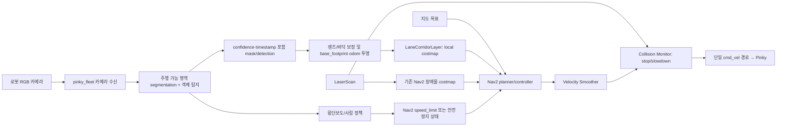

# 실물 Pinky Pro 차선 인식·주행 계획 및 기술 검토

## 1. 목표

지도에서 보낸 Nav2 목표를 유지하면서 카메라가 본 주행 가능 영역 안으로 경로를 제한하고, 횡단보도에서는 정해 둔 정책에 따라 감속·정지하며, 장애물은 우회하거나 안전하게 멈추는 것이 목표다.

대상은 실물 Pinky Pro 2대이며 로봇별 ROS_DOMAIN_ID는 15/17이다. 현재 있는 카메라 영상·YOLO 표시는 관찰 기능이다. 이 문서는 그 결과를 주행에 연결하기 전의 설계와 검증 순서를 정한다. 계획 단계에서 로봇을 움직이거나 속도 명령을 보내지 않는다.

## 2. 현재 코드와 확인된 제약

저장소를 기준으로 현재 상태는 다음과 같다.

- `pinky_fleet/perception.py`는 고정 모델 `yolo11n.pt`를 로드하고 객체 상자와 클래스 결과를 만든다. 현재 가중치는 COCO 일반 객체 모델이며 차선·횡단보도·주행 가능 영역을 인식하도록 학습된 모델이 아니다.
- 카메라는 로봇 HTTP snapshot/MJPEG를 PC에서 받고, 브라우저에 영상과 YOLO 오버레이를 표시한다. 현재 로봇1에서 영상·추론이 동작하는 것이 확인됐다.
- BLE `set_camera` 요청은 320×240, 15 FPS를 지정한다. 이 값은 요청값이며 실제 camera output FPS/해상도는 robot endpoint에서 다시 측정해야 한다.
- `pinky_fleet/params/nav2_params.yaml`의 local costmap은 odom 기준 rolling 3×3 m, 5 Hz이며 `/scan` voxel layer와 inflation layer를 사용한다. global costmap도 정적 지도, `/scan` 장애물 layer, inflation을 사용한다.
- Nav2 controller는 `cmd_vel_nav`를 내고 velocity smoother가 이를 로봇의 상대 토픽 `cmd_vel`로 전달한다. 현재 Pinky navigation launch에는 `nav2_collision_monitor`가 실행되지 않는다.
- `pinky_bringup`은 `cmd_vel`을 받으면 모터 RPM을 설정한다. 속도 명령이 끊겼을 때 마지막 속도를 해제하는 타임아웃이 없다는 운영 제약이 있다.
- 카메라는 단안 RGB 영상이다. 현재 camera image timestamp/렌즈 보정/카메라-로봇 좌표 변환이 주행용으로 확인되지 않았다.
- 한 카메라에서 약 11 FPS 추론이 보고됐지만, 로봇 두 대 동시 추론의 최대 지연·드롭률은 아직 측정하지 않았다.

현재 코드 경로: [인식](../pinky_pro/src/pinky_fleet/pinky_fleet/perception.py), [Nav2 파라미터](../pinky_pro/src/pinky_fleet/params/nav2_params.yaml), [실물 Nav2 launch](../pinky_pro/src/pinky_navigation/launch/navigation_launch.xml), [로봇 속도 수신](../pinky_pro/src/pinky_bringup/pinky_bringup/bringup.py).

## 3. 기술 검토와 권장 구조

### 기존 YOLO 가중치만으로는 차선 주행을 만들 수 없다

`yolo11n.pt`의 COCO 클래스는 사람·차량 등 일반 사물이다. 차선, 바닥 안쪽, 횡단보도 픽셀은 이 모델 결과에서 나오지 않는다. 사전 학습된 일반 segmentation 모델도 목표 바닥의 차선 경계 성능을 보장하지 않는다. 실제 카메라 영상으로 주행 가능 영역 segmentation 데이터를 만들고 fine-tune한 모델이 필요하다.

첫 데이터셋은 `driveable_area`, `crosswalk`, `person`, `vehicle`, `obstacle` 후보로 시작하되, 실물 바닥과 장애물 정의를 확인한 뒤 클래스를 확정한다. 차선 두 줄만 찾는 방식보다 **로봇 footprint가 들어갈 수 있는 주행 가능 영역 mask**를 예측하는 편이 바닥 무늬·테이프·교차로를 함께 다루기 쉽다. 횡단보도는 주행 불가 영역이 아니라 별도의 의미 영역으로 분리한다.

### Nav2 목표 주행과 비전 차선 제약을 결합한다

권장 구조는 비전 노드가 별도 `cmd_vel`을 발행하지 않는 것이다. Nav2가 지도 목표를 따라가고, 카메라 segmentation으로 만든 근거리 차선 통로를 local costmap에 적용한다. local planner는 라이다 장애물과 lane corridor 밖 비용을 함께 고려해 통로 안에서 경로를 추종한다.

영상 pixel mask를 그대로 costmap에 넣을 수는 없다. 카메라 intrinsic/distortion과 바닥에 대한 extrinsic을 보정하고, 평면 바닥 가정으로 bird's-eye/local metric mask를 만든 뒤 현재 `base_footprint`/`odom`과 TF로 정렬해야 한다. 가장 현실적인 구현 후보는 별도 `LaneCorridorLayer` costmap plugin이다. 이 plugin은 현재 카메라 시야 안에서 확실히 driveable로 분류한 cell만 통과 가능하게 하고, 통로 바깥·미검출·오래된 cell은 통과 불가로 둔다. 지역 mask가 없는 방향으로 Nav2가 우회해 차선 밖으로 나가지 않게 마스크 경계와 적용 범위를 설계한다.

Nav2 `KeepoutFilter`는 지도에 고정된 금지 구역에 적합하다. 카메라가 매 순간 새로 보는 차선 통로를 직접 대체하지는 않는다. 고정된 실내 금지 구역에는 Keepout Filter를 쓸 수 있고, 카메라 기반 동적 corridor는 local costmap plugin/동적 costmap representation을 검토한다. Nav2의 Speed Filter/Controller `speed_limit_topic`은 양수 최대 속도를 제한하는 데 쓸 수 있다. Jazzy `SpeedLimit`에서 0은 정지가 아니라 제한 해제를 뜻하므로, 정지 요구를 0 속도 제한 메시지로 구현하면 안 된다. 정지는 lane/costmap 차단이나 단일 제어권을 가진 stop supervisor와 검증된 하위 속도 경로로 설계한다.

### 장애물 회피는 라이다 중심으로 유지한다

현재 Nav2는 `/scan`을 local/global costmap에 반영한다. 기본 장애물 회피는 이 경로를 유지하고, 가까운 충돌을 빠르게 막을 별도 Nav2 Collision Monitor를 velocity smoother 뒤에 추가하는 것을 권장한다. Collision Monitor는 최신 LaserScan으로 stop/slowdown 영역을 판단해 `cmd_vel`을 조정할 수 있지만 CPU 소프트웨어 기능이며 인증된 비상정지 장치는 아니다.

YOLO는 사람·차량처럼 **무엇인지** 알려주는 semantic sensor로 쓴다. 단안 2D box만으로 안전한 거리나 정지거리를 계산하지 않는다. 카메라 물체를 costmap obstacle로 넣으려면 detection과 LaserScan을 카메라/라이다 외부 보정 및 TF로 연결해 metric 위치를 추정해야 한다. 라이다에서 확인되지 않은 object는 초기에는 정지·저속 정책의 보조 입력으로만 쓰고, camera-only 2D 크기를 거리로 환산해 자동 회피시키지 않는다.

### 횡단보도는 별도 주행 정책으로 다룬다

횡단보도 mask를 lane 밖으로 취급하면 정상적으로 길을 건너지 못한다. 먼저 의미 인식과 속도 정책을 분리한다. 초기 제안은 횡단보도 전방 감지 시 낮은 속도로 제한하고, 횡단보도 위 사람 감지 또는 주변 위험 신호가 있으면 정지하는 것이다. 정지선에서 항상 멈출지, 사람/장애물이 없으면 통과할지는 제품 정책으로 확정해야 한다. 이 정책을 확정하기 전에는 횡단보도 검출 결과를 주행에 연결하지 않는다.

## 4. 권장 데이터 흐름

비전 결과 인터페이스는 로봇별 분리를 유지한다. 후보 출력은 `perception/driveable_mask`, `perception/crosswalk_mask`, `perception/objects`, `perception/status`다. 각 결과에 frame sequence, host receive time, inference time, confidence, camera health를 포함한다. ROS message/topic 이름과 QoS는 다음 구현 설계에서 확정한다. 현재 화면용 detection JSON을 그대로 주행 노드 계약으로 사용하지 않는다.

## 5. Fail-safe 정책 초안

| 상황 | Nav2/비전 정책 |
|---|---|
| lane mask 정상, Nav2 경로가 mask 안에 있음 | 기존 Nav2 주행을 허용 |
| lane 경계가 불확실하거나 한쪽/양쪽 경계가 사라짐 | corridor를 추측해 넓히지 않고 감속 후 정지 상태로 전환 |
| 영상/추론/TF가 stale, camera stream 단절 | lane layer를 permissive로 해제하지 않는다. 진행을 중단하고 정지 확인 |
| Nav2 경로가 lane corridor와 교차하지 않음 | 차선 밖 우회를 허용하지 않고 목표 재계산 또는 운영자 확인 대기 |
| 라이다가 corridor 안에서 장애물을 검출 | Nav2가 우회하되 우회 경로가 lane mask 안에 없으면 정지 |
| 사람을 corridor 앞에서 검출 | 보정된 거리/라이다 corroboration을 우선. 정책상 정지 조건이면 정지 후 재개 조건 충족 전 대기 |
| 횡단보도 검출 | 확정된 speed limit/stop-line 정책 적용. mask는 여전히 통과 가능한 바닥으로 유지 |
| 최종 safety/command process가 죽거나 ROS 연결이 끊김 | 로봇 측 watchdog이 정해진 시간 내 모터 명령을 0으로 만든다 |

**중요한 선행 조건:** downstream에서 한 번 0 `Twist`를 보내는 것만으로는 명령 발행기 사망 시 모터가 안전해지지 않는다. 수신이 끊기면 로봇 쪽 `pinky_bringup`/motor command layer에 heartbeat timeout이 있어야 한다. Collision Monitor도 CPU 기반 보조 감시이지 hardware E-stop를 대체하지 않는다. 로봇 firmware watchdog과 물리 비상정지 절차가 검증되기 전에는 무인 자율주행으로 전환하지 않는다.

## 6. 단계별 할 일과 완료 조건

### 0단계 — 주행 규칙과 운영 범위 확정

- [ ] 로봇이 다닐 공간, 바닥 재질/색, lane 표시 방식, lane 폭, 최소 회전 폭, 최대 속도를 기록한다.
- [ ] 차선이 끊긴 교차로/목표 지점/횡단보도에서 허용할 동작을 결정한다.
- [ ] `person`, `other obstacle`, 차량/의자/상자 중 무엇을 검출할지 정한다.
- [ ] 횡단보도에서 감속·정지·사람 없을 때 통과 중 정책을 정한다.
- [ ] 정지 복귀 조건, 운영자 override, 물리 E-stop 담당자를 정한다.
- **완료 조건:** ODD(운영 환경 범위)와 각 class→행동 정책표가 승인됨.

### 1단계 — 센서·속도 경로·정지 체계 확인

- [ ] 로봇별 실제 camera image size/FPS/노출/지연(요청값 320×240, 15 FPS와 비교), camera mount/optical frame, TF를 확인한다.
- [ ] 카메라 intrinsic/distortion calibration을 하고 평면 바닥의 위치 측정점으로 homography 오차를 잰다.
- [ ] `/scan`이 실제 로봇 앞 물체를 어느 거리·높이에서 검출하는지 기록한다. 현재 Nav2 local/global costmap source 설정과 사각지대를 조사한다.
- [ ] `cmd_vel_nav → velocity_smoother → cmd_vel → pinky_bringup` 단일 경로를 런타임 topic info/echo로 확인한다.
- [ ] 로봇 쪽 cmd_vel heartbeat timeout 설계/적용 위치와 hardware E-stop 동작을 확인한다.
- [ ] Nav2 Jazzy Collision Monitor의 실제 패키지 설치, launch/lifecycle, `/scan` 입력과 `Twist` 출력(`enable_stamped_cmd_vel: false`) 경로를 구성 설계한다.
- **완료 조건:** 카메라-로봇 좌표 오차, braking distance, end-to-end latency 기준, watchdog 요구시간을 기록함.

### 2단계 — 현장 영상 수집 및 데이터셋

- [ ] 실제 운영 바닥에서 정상 통로, 커브, 교차로, 횡단보도, 테이프/경계 손상, 그림자, 조명 변화, 가림, 정지/주행 시점을 촬영한다.
- [ ] 장면 단위로 train/validation/test를 나눈다. 인접한 연속 프레임을 무작위로 나눠 평가 누수가 생기지 않게 한다.
- [ ] 주행 가능 영역 polygon, 횡단보도 polygon, 장애물/person box/mask를 정의된 가이드로 라벨링한다.
- [ ] 얼굴/개인정보 포함 영상의 보관 위치, 접근 권한, 삭제 기한을 정한다.
- **완료 조건:** 라벨 가이드와 독립 test set을 고정하고 버전/수량을 기록함.

### 3단계 — 오프라인 모델 및 geometry 평가

- [ ] `yolo11n-seg.pt` 등을 transfer learning 시작점으로 비교하되 custom dataset 성능으로 모델을 선택한다. 기존 `yolo11n.pt`는 객체 baseline으로만 사용한다.
- [ ] segmentation quality(IoU/precision/recall), false-driveable 경계 오차, 횡단보도 recall, 사람/장애물 precision·recall을 class별로 산출한다.
- [ ] image mask를 ground-plane/local grid로 변환하고, 바닥 측정점에서 위치 오차·회전 오차를 산출한다.
- [ ] confidence threshold와 경계 margin을 바꿔 robot footprint가 corridor 안에 남는 비율을 확인한다.
- [ ] 두 카메라 동시 입력 시 GPU/CPU, peak latency, frame drop, stale duration을 잰다.
- **완료 조건:** 안전 threshold와 허용 가능한 실패율을 실물 주행 전에 합의하고 test set에서 통과함.

### 4단계 — 비주행 관측 모드

- [ ] custom 모델 mask, lane corridor, crosswalk, obstacle detection과 confidence를 대시보드에 시각화한다.
- [ ] 각 mask를 costmap grid에 투영한 가상 화면을 표시하되 로봇 주행에는 연결하지 않는다.
- [ ] 영상 끊김, 추론 지연, TF 누락, mask loss 상황을 기록하고 UI에서 stale/invalid가 구별되게 한다.
- [ ] 주행 영상을 저장/재생해 동일 입력에 정책 출력이 재현되는지 확인한다.
- **완료 조건:** 운영자가 영상과 costmap overlay만 보고 lane/비전 판단 오류를 발견할 수 있음.

### 5단계 — Nav2 lane corridor와 speed policy

- [ ] `LaneCorridorLayer`의 frame, update frequency, valid polygon, lethal/unknown cost, clearing/expiry 규칙을 설계한다.
- [ ] local costmap에서 lane 밖을 막고, 카메라 시야 밖/신뢰도 미달 영역에서 경로가 새 corridor로 이어지지 않으면 멈추게 한다.
- [ ] 횡단보도·정책 감속은 Controller Server `speed_limit_topic`에 단일 정책 supervisor가 제한값을 publish하도록 연결한다.
- [ ] Nav2 Jazzy Collision Monitor를 velocity smoother 뒤 최종 `cmd_vel` 경로에 추가해 `/scan` stop/slowdown zone을 적용한다.
- [ ] `SpeedLimit`의 0을 stop으로 오용하지 않는다. 정지와 제한 해제 동작을 별도 상태/전이로 정의한다.
- [ ] 최종 `cmd_vel` 발행자가 하나인지, stamped/unstamped `Twist` 타입과 이름 remap이 Pinky driver와 일치하는지 확인한다.
- **완료 조건:** 정지된 로봇/로그 재생에서 planned path와 모든 footprint가 valid lane corridor 안에 있고, 장애물·invalid input을 fail-safe로 처리함.

### 6단계 — 정지 상태/HIL 검증

- [ ] 바퀴를 띄우거나 구동부를 물리적으로 분리한 시험 장치에서 속도 경로와 timeout만 검증한다.
- [ ] lane mask 소실, camera disconnect, inference crash, TF stale, `/scan` stale, ROS network loss, Collision Monitor process exit를 각각 주입한다.
- [ ] heartbeat timeout 뒤 실제 모터 명령이 0이 되는지 외부에서 확인하고, 복구 뒤 자동으로 뜻하지 않게 재출발하지 않는지 확인한다.
- [ ] 강제 정지, 목표 취소, 재개 명령, 두 로봇 동시 장애 이벤트를 검증한다.
- **완료 조건:** 각 fault가 지정된 시간 안에 정지 상태로 가고, 재개는 명시된 조건에서만 가능함.

### 7단계 — 승인 후 제한된 실물 저속 시험

- [ ] 사람 확인을 받은 뒤 사람이 로봇 옆에 있고 물리 E-stop을 잡은 통제 구역에서 시작한다.
- [ ] 가장 낮은 속도와 짧은 직선 구간부터 시험하고, 그 다음 커브·교차로·횡단보도·장애물을 한 종류씩 추가한다.
- [ ] 1대 검증 후 2대 동시 운용을 별도 승인하고 Wi-Fi/GPU 부하를 다시 측정한다.
- [ ] 오검출/미검출, lane 이탈, stop distance, latency, 복구 행동을 매 시험마다 기록한다.
- **완료 조건:** 사전 승인한 metrics와 안전 시나리오 전부 통과. 실패 시 관측 모드로 되돌린다.

## 7. 주요 기술 선택 비교

| 선택지 | 장점 | 제약/판단 |
|---|---|---|
| YOLO 일반 객체 모델만 사용 | 사람·차량 등 시각화를 빨리 시작 | lane/crosswalk mask를 내지 않으므로 lane-follow 목표에는 부족 |
| 커스텀 segmentation + 기하 투영 | 주행 가능 영역을 Nav2 costmap에 넣을 수 있음 | 학습 데이터, calibration, ground-plane 가정, custom costmap plugin 필요. 권장 |
| 카메라에서 직접 `cmd_vel` 생성 | 작은 실험은 빠름 | Nav2와 명령 경쟁, 목표지점·지도·장애물 회피 통합 어려움. 제품 경로로는 비권장 |
| Nav2 local costmap corridor + 기존 lidar | 목표/맵 주행과 lane 제한을 함께 유지 | mask projection과 costmap plugin 검증 필요. 기본 권장 구조 |
| 단안 YOLO box로 거리/정지거리 추정 | 추가 거리 센서 없이 시도 가능 | 크기·원근 의존 오차가 크고 안전한 거리 보장이 안 됨. 안전 기능으로 사용 금지 |
| Nav2 Collision Monitor | costmap planner와 별도 근거리 stop/slowdown 경로 | CPU 기반 보조 감시, 안전 인증 장치가 아님. 로봇 watchdog/E-stop 대체 불가 |

## 8. 성능·안전 통과 기준으로 기록할 지표

숫자는 환경/속도/정지거리 측정 뒤 **주행 연결 전에** 팀이 정한다. 임의의 FPS나 모델 mAP 하나로 통과 처리하지 않는다.

- 주행 가능 영역: class IoU/recall, false-driveable pixels, corridor 경계의 실제 위치 오차, footprint 포함 margin.
- 횡단보도: 장면별 recall, 정책 전환의 false positive/negative, 감지 시점부터 속도 변경까지 지연.
- 장애물/person: class별 precision/recall, lidar fusion 성공률, 장애물 발견부터 정지까지의 시간·거리.
- 런타임: source age, inference latency p50/p95/max, 두 카메라 동시 frame drop, TF age, costmap update age.
- 안전: 최대 실험 속도에서 관측된 정지 거리, 지정 input/process/네트워크 failure 때 정지 시간, watchdog 동작과 재출발 방지.
- 차선 유지: 시험 전체에서 로봇 footprint가 lane 경계 밖으로 나간 횟수·최대 거리. 허용값은 안전 검토 후 정한다.

## 9. 착수 권장 순서

1. 이 문서의 주행 정책·운영 범위를 확정한다.
2. 카메라 보정값, 실물 데이터셋, test set을 만든다.
3. custom segmentation을 학습하고 오프라인에서 차선·횡단보도 mask를 평가한다.
4. dashboard observer에 mask/costmap overlay를 표시한다. 이 단계까지는 주행에 연결하지 않는다.
5. LaneCorridorLayer와 single-owner speed policy를 구현한다.
6. Collision Monitor와 로봇 측 cmd_vel watchdog을 별도로 검증한다.
7. 정지 상태/HIL 시험을 끝낸 뒤 사람 승인으로 제한된 저속 실물 시험을 시작한다.

Nav2 기술 참고:

- [Nav2 Jazzy Collision Monitor](https://docs.nav2.org/jazzy/configuration_and_development/configuration_guide/core_servers/collision_monitor/)
- [Nav2 Jazzy Collision Monitor 설정](https://docs.nav2.org/jazzy/configuration_and_development/configuration_guide/core_servers/collision_monitor/configuring_collision_monitor_node/)
- [Nav2 Jazzy Controller Server speed limit topic](https://docs.nav2.org/jazzy/configuration_and_development/configuration_guide/core_servers/controller_server/)
- [Nav2 Jazzy Keepout/Speed Filter 개요](https://docs.nav2.org/jazzy/configuration_and_development/configuration_guide/core_servers/costmap_2d/)
