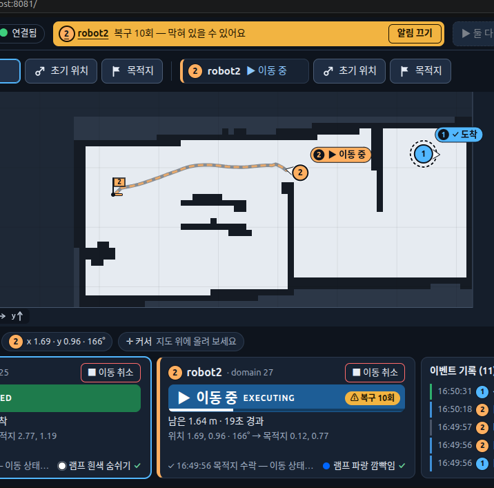
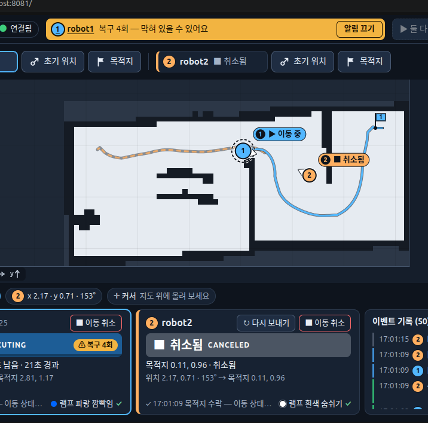
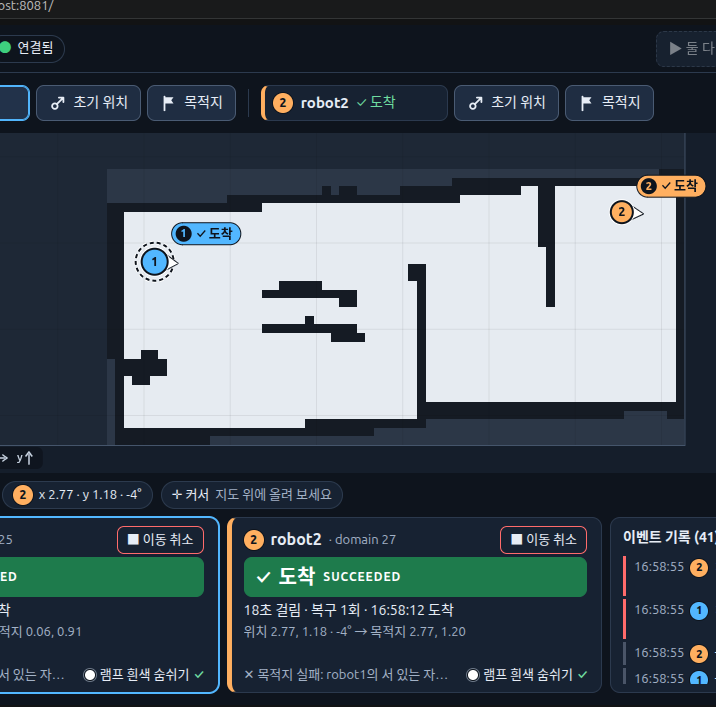
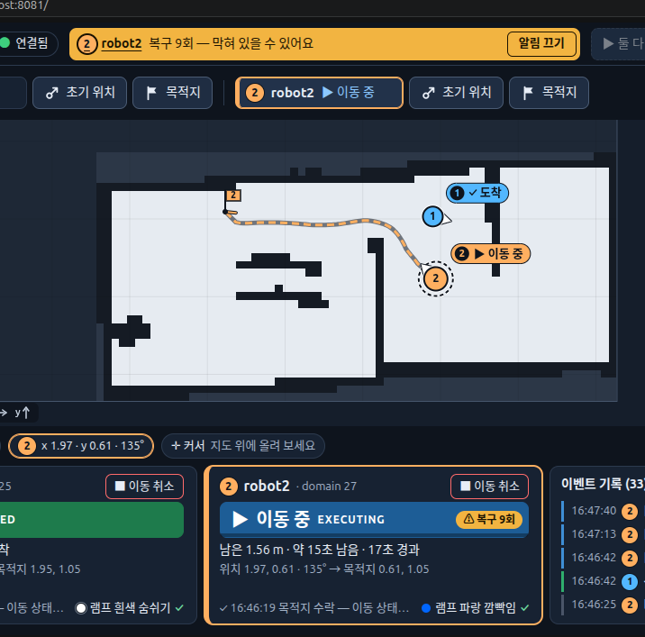
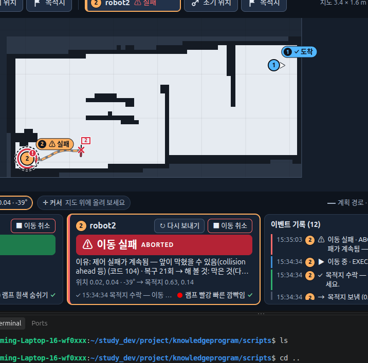
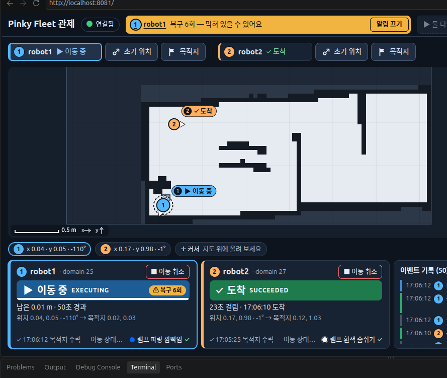

# 시뮬 주행 문제와 수정 기록 (2026-10-03)

Gazebo(`sim.launch.py`, good3 지도)에서 로봇 2대를 같이 움직이며 나온 문제, 원인, 바꾼 값을 남긴다.
실물로 옮길 때와 같은 문제가 다시 나올 때 여기부터 본다. 실행 방법은 [sim.md](sim.md), 실물은 [real.md](real.md).

> 상태: 아래 변경은 브랜치 `feat/spin-localization`에 있고 **아직 커밋 전**이다. 단위 테스트(`pinky_fleet/test`)는 통과했다.
> 시뮬에서 직접 확인한 것과 아직 확인하지 않은 것은 항목마다 적었다.

## 바꾼 값 한눈에

| 무엇 | 파일 | 전 | 후 | 이유 |
|---|---|---|---|---|
| 제어 실패 허용 시간 `failure_tolerance` | `pinky_fleet/params/nav2_params.yaml` | 0.3 s | **1.5 s** | 문에서 잠깐의 충돌 오판으로 바로 실패 (3) |
| 충돌 검사 앞 시간 `max_allowed_time_to_collision_up_to_carrot` | 〃 | 1.0 s | **0.5 s** | 멀리 흔들린 벽 점에 걸림 (3) |
| 최소 주시 거리 `min_lookahead_dist` | 〃 | 0.3 m | **0.15 m** | 문을 나오며 코너를 질러 문틀에 붙음 (5) |
| 커브 감속 `use_regulated_linear_velocity_scaling` | 〃 | false | **true** | 〃 |
| 경로 겹침 거리 `yield_distance` | `pinky_fleet/params/traffic_good3.yaml` | (새로) 0.30 | **0.25 m** | robot2가 너무 일찍 멈춤 |
| robot2가 보는 앞 경로 `yield_lookahead` | 〃 | (새로) 1.0 | **0.5 m** | 〃 |
| robot1이 보는 앞 경로 `yield_leader_ahead` | 〃 | (없음: 남은 경로 전체) | **0.8 m** | 멀리서부터 비키지 않게 |
| 양보 풀기 여유 `yield_release` | 〃 | — | 0.10 m | 멈춤↔출발 떨림 방지 |
| 한 번 물러나는 거리·속도·횟수 | `fleet_dashboard.py` `BACK_STEP/SPEED/LIMIT` | — | 0.15 m · 0.08 m/s · 3번 | robot2 양보 |
| 실패 시 다시 보내기 | `fleet_dashboard.py` `RETRY_CODES/LIMIT` | — | 코드 0·104·105·106, 3번 | 막혀서 실패해도 다시 하면 지나감 |
| Gazebo 벽 / 바닥 색 | `pinky_fleet/worlds/good_map.world` | 회색 0.6 / 0.8 | 남색 (0.15 0.22 0.35) / 흰색 0.95 | 화면에서 구분이 안 됨 |
| Gazebo 로봇 몸체 색 | `pinky_fleet/launch/sim.launch.py` `ROBOT_RGB` | 메시 기본(회색) | robot1 파랑 · robot2 주황 | 〃 |

Nav2 설정은 제조사 원본(`pinky_navigation/params/nav2_params.yaml`)을 고치지 않고 **팀용 복사본** `pinky_fleet/params/nav2_params.yaml`을 새로 만들어 고쳤다.
`multi_robot.launch.py`의 기본 `params_file`이 이 복사본이라 실물에도 같이 적용된다. 바꾼 줄에는 `팀:` 주석이 있다.

---

## 1. 시뮬이 여러 개 떠서 시계 경고, 색이 안 바뀜

- **상황**: 대시보드에 "로봇 시계가 PC와 N초 달라요 — sync_robot_clock.sh". Gazebo 색을 바꿨는데 화면은 그대로.
- **원인**: Ctrl+Z로 "끈" 시뮬이 멈춘 채 남아 Gazebo 서버가 4개까지 떴다. 모두 같은 도메인 25/27에 `/clock`·`/odom`을 내서 시각이 섞였고, Gazebo 창은 예전 서버에 붙어 있었다.
  `sync_robot_clock.sh`는 **실물용**이라 시뮬에서는 쓰지 않는다.
- **해결**: 끌 때는 항상 Ctrl+C. 이미 쌓였으면 정리하고 하나만 켠다.
  ```bash
  pkill -9 -f "gz sim"; pkill -9 -f sim.launch.py; pkill -9 -f fleet_dashboard; pkill -9 -f parameter_bridge; ros2 daemon stop
  ```
  (Ctrl+Z로 멈춘 프로세스는 보통 종료 신호를 못 받아 `-9`가 필요하다.)

## 2. 시뮬 시계(`/clock`)가 안 와서 위치를 못 잡음

- **상황**: 시뮬을 하나만 켰는데도 두 로봇 위치가 안 뜨고 시계 차이 약 38초.
- **원인**: 이 PC는 실물용으로 `~/.bashrc`에서 **Cyclone DDS**(`RMW_IMPLEMENTATION=rmw_cyclonedds_cpp`)를 쓴다. 같은 도메인에서 6초 동안 `/odom`은 301개 왔는데 `/clock`은 0개였다.
  `/clock`은 초당 수백 번, 받는 노드가 19개라 느린 구독자 때문에 전송이 막힌 것으로 본다(측정 기반 추정).
- **해결**: `sim.launch.py`가 Fast DDS를 자동으로 지정한다. 시뮬은 PC 안에서만 통신하므로 실물(Cyclone)과 상관없다.
  ```bash
  ros2 launch pinky_fleet sim.launch.py port:=8081
  ```
  (이 PC는 8080을 Docker가 써서 `port:=8081`.) 시뮬 터미널에서 ROS 토픽을 확인할 때도 `RMW_IMPLEMENTATION=rmw_fastrtps_cpp`를 지정한다.

## 3. 좁은 문에서 막힌 게 없는데 "복구 N회", 이동 실패(104)



- **상황**: robot1은 멀리 도착해 있고 robot2 혼자 문(폭 0.35 m)을 지나는데 복구 10회, 결국 실패 코드 104.
- **원인**: Nav2 로그에 `RegulatedPurePursuitController detected collision ahead!`가 750번. 시뮬 라이다 노이즈가 ±2 cm(stddev 0.02)인데 로컬 코스트맵은 1 cm 칸이라
  문틀 점이 흔들리며 로봇이 지나갈 자리에 잠깐씩 걸렸다. 이것이 0.3초만 이어져도 실패로 처리됐다.
- **해결**:
  - `failure_tolerance` 0.3 → **1.5 s**: 잠깐의 오판은 멈춰 기다렸다 이어 간다.
  - `max_allowed_time_to_collision_up_to_carrot` 1.0 → **0.5 s**: 충돌 검사를 가까운 앞만.
  - 대시보드가 막혀서 실패한 목표(코드 0·104·105·106)를 **같은 목적지로 3번까지 다시 보낸다**. 벽 위 목적지(206) 같은 실패는 다시 보내지 않는다.
- **확인**: 다시 보내기는 시뮬에서 동작을 봤다("robot2 막혀서 실패 → 다시 보냄 (1/3)" 뒤 도착). Nav2 값 변경 효과는 아직 충분히 보지 못했다.

## 4. 교통 정리 방식: 출발 전 예약 → 달리면서 양보

- **상황**: 예전 방식(칸 열쇠)은 길이 겹치면 robot2가 **아예 출발하지 않고** 기다렸다. 원하는 것은 둘이 같이 움직이다 부딪힐 것 같을 때만 비키는 것.
- **정한 규칙**: 겹치면 **robot1이 항상 먼저**, robot2가 양보한다(`fleet_dashboard.py` `LEADER/FOLLOWER`).
- **동작** (`traffic.py` `YieldRule`, 0.2초마다):
  - **go**: 겹치지 않음. robot1이 멈춰 있으면(목표 없음) 판단하지 않는다 — 서 있는 로봇은 Nav2가 장애물로 피한다.
  - **stop**: robot2 앞 0.5 m 경로가 robot1 앞 0.8 m 경로와 0.25 m 안 → robot2 목적지를 기억하고 Nav2 목표 취소.
  - **back**: robot2가 robot1 앞 0.8 m 경로 위에 서 있음 → Nav2 후진 동작(충돌 검사 포함)으로 0.15 m 물러난다. 3번 물러나도 길 위면 멈춰 기다린다.
  - robot1이 지나가면 기억해 둔 목적지로 robot2를 다시 출발. 양보 중 사람이 취소·새 목적지를 주면 기억한 목적지는 버린다.
- **조정**: 처음 값(겹침 0.30 m, robot2 앞 1.0 m, robot1 남은 경로 전체)은 robot1이 멀리 있어도 robot2가 멈췄다 → 위 값으로 줄였다. 두 로봇이 대략 1.3 m 안으로 올 때만 양보한다.
- **목적지 찍기와 출발 분리** (`web/fleet.html`): ⚑ 목적지(`G`)는 깃발만 꽂고(출발 대기), 카드의 **▶ 출발** 또는 위의 **▶ 둘 다 출발**로 보낸다.
- **확인**: 시뮬에서 robot2가 멈췄다가 "robot1이 지나가서 다시 출발"하는 것을 봤다.

## 5. 문을 나오며 꺾일 때 문틀에 붙음



- **상황**: robot1이 문 안 (1.63, **0.89**)에서 실패. 문틈은 y 0.88~1.23이라 아래 문틀에 실제로 붙어 있었다(제자리 회전 복구도 "Collision Ahead"로 멈춤).
  위 사진처럼 robot2가 robot1이 갈 칸막이 통로 입구 옆에 멈춰 있어 더 좁았다.
- **원인**: RPP가 최소 0.3 m 앞을 보고 따라가서, 문을 나오자마자 꺾이는 경로에서 **코너를 안쪽으로 질렀다**. (3)의 robot2도 꺾이는 쪽 문틀(y 0.96)에 붙어 있었다.
- **해결**: `min_lookahead_dist` 0.3 → **0.15 m**, `use_regulated_linear_velocity_scaling` false → **true**(급커브 감속).
- **확인**: 아직 시뮬에서 충분히 보지 못했다.
- **남은 점**: robot2가 "멈춰 기다리는 자리"가 robot1의 위험 구역(inflation 0.4 m) 안이면 여전히 길을 막는다. 양보 자리 고르기는 다음 과제.

## 6. 서로 자리 바꾸기가 "서 있는 자리와 너무 가까움"으로 거절됨



- **상황**: robot1을 robot2 자리로, robot2를 robot1 자리로 보내면 "목적지 실패: robot1의 서 있는 자리…".
- **원인**: 목적지 검사가 "다른 로봇이 **지금 서 있는** 자리 0.35 m 안"을 거절했다. 곧 떠날 자리인데도 막았다.
- **해결**: 대시보드에서는 서 있는 자리는 막지 않고(`check_target(..., parked=False)`), **다른 로봇이 가고 있는 목적지** 0.35 m 안만 막는다. 자리 바꾸기는 **▶ 둘 다 출발**로 한다(한 대만 보내면 서 있는 로봇 앞에서 실패한다).

## 7. robot1이 문 옆에 서 있어 robot2가 겨우 지나감 (미해결)



- **상황**: robot1이 문 바로 옆 (1.95, 1.05)에 도착해 서 있고, robot2가 그 옆을 비집고 지나가며 복구 9회.
- **생각한 해결**: 서 있는 robot1이 robot2 앞 경로를 막으면 robot1이 30~50 cm 비켜 준다. **비켜 준 뒤 원래 자리로 돌아갈지**는 아직 정하지 않았다.

## 8. 구석 (미해결)




- **상황**: 구석 목적지로 가면 끼어서 실패하거나(위), 목적지 1 cm 앞까지 와서도 끝내지 못하고 복구만 반복한다(아래).
  Gazebo 실제 위치(0.07, 0.07)와 AMCL(0.02, 0.04) 차이는 약 5 cm라 **위치 찾기 문제는 아니다**.
- **원인**: 도착 판정이 **위치 3 cm + 방향 14°**(`general_goal_checker` `xy_goal_tolerance: 0.03`, `yaw_goal_tolerance: 0.25`)로 엄격하다.
  도착해서 목표 방향으로 제자리 회전을 하는데 몸체 뒤가 0.08 m 튀어나와(회전 반경 약 0.094 m) 구석 두 벽에 걸린다.
- **해 봤다가 되돌린 것**: "벽에서 15 cm 안쪽 목적지 거절"을 넣었더니 구석으로 **아예 보낼 수 없게** 되어 되돌렸다. 구석도 갈 수 있어야 한다.
- **다음 후보**: `xy_goal_tolerance` 0.03 → 0.08 m (구석을 막지 않고 도착 근처에서 맴도는 것만 줄인다). 아직 적용 안 함.

---

## 다음 할 일

- [ ] (8) 구석 도착: `xy_goal_tolerance` 조정 시험
- [ ] (7) robot1 비켜 주기: 원래 자리로 돌아갈지 결정
- [ ] (5) robot2 양보 자리를 robot1 위험 구역 밖으로 고르기
- [x] 화면에 양보 중·재시도 상태 표시
- [x] `sim.launch.py`가 스스로 Fast DDS를 쓰게 하기 (2)
- [ ] 실물 로봇에서 같은 값 확인 (특히 Nav2 팀 설정)
- [ ] 커밋 (목적별로 나눠서)
